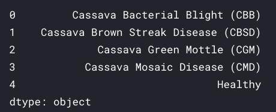
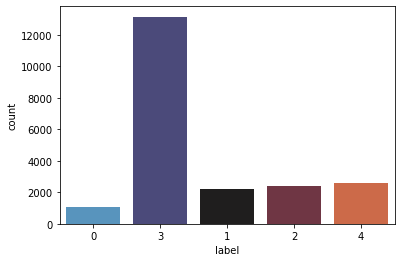
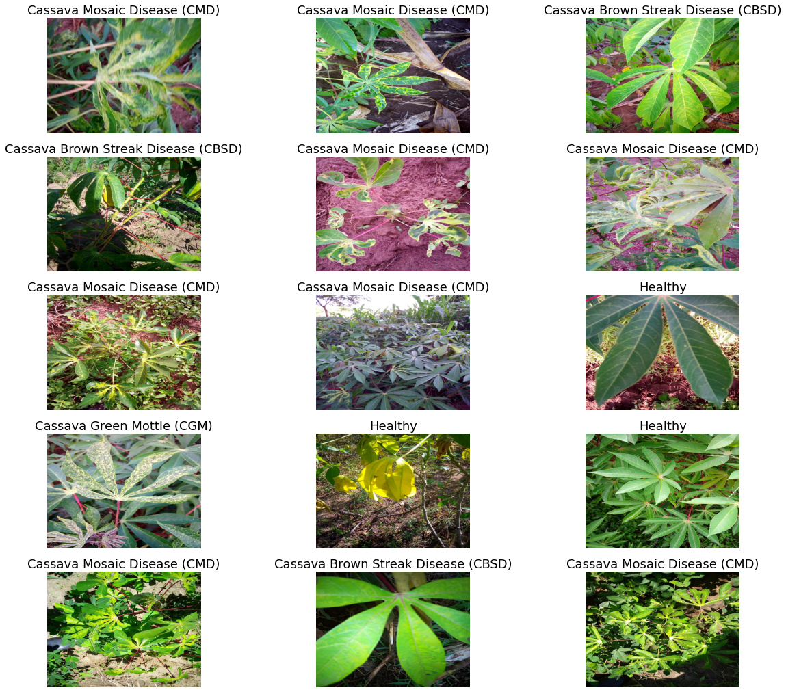
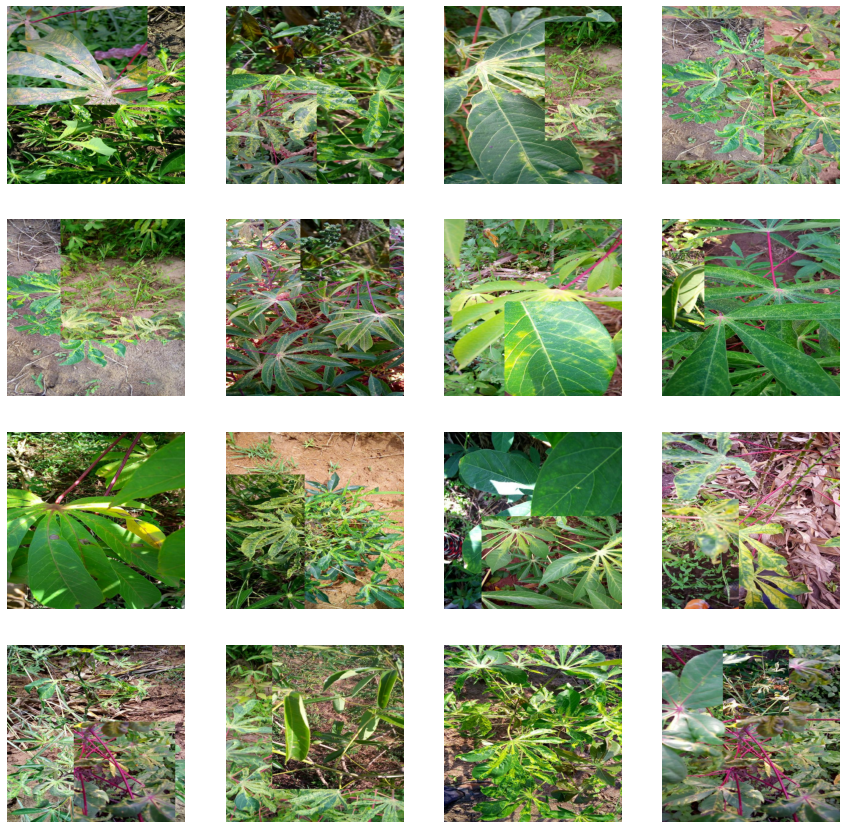
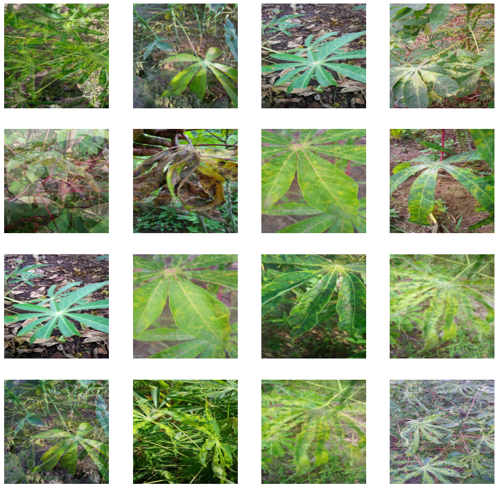
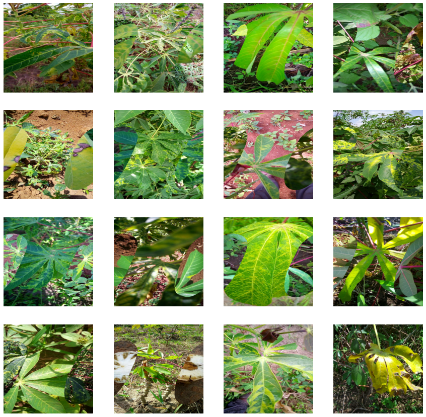
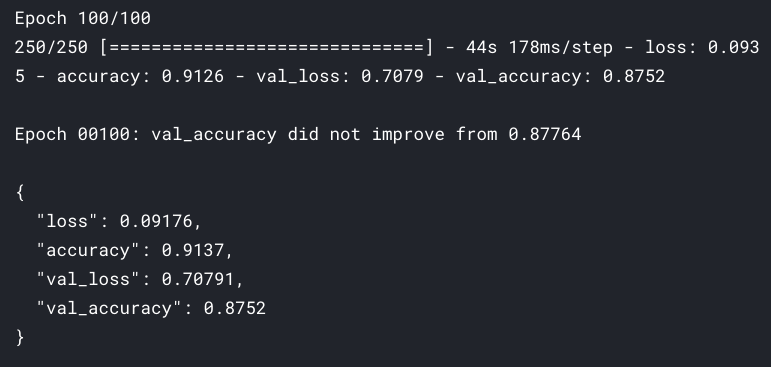
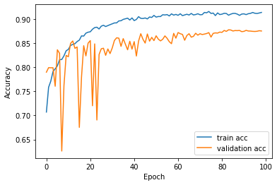
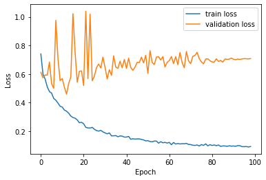
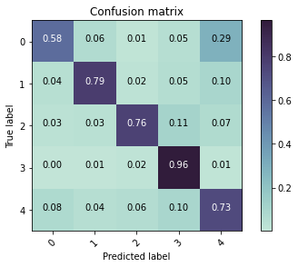

# cassava-leaf-disease-classification

[Cassava Leaf Disease Classification](https://www.kaggle.com/c/cassava-leaf-disease-classification) is a Kaggle's Research Code Competition where you have to identify the type of disease present on a Cassava Leaf image.

## Table of contents

- [Getting started](#getting-started)
- [Info about the dataset](#info-about-the-dataset)
- [Specail features](#special-features)
- [Outcome](#outcome)
- [Issues](#issues)
- [License](#license)

## Getting started

The [notebook](https://www.kaggle.com/akashsdas/cassava-leaf-disease-classification/) is available on Kaggle to work in the same environment where this notebook was created i.e. use the same version packages used, etc...

If you are interested in the model the you can find that in the [output](https://www.kaggle.com/akashsdas/cassava-leaf-disease-classification/output) section of the notebook.

Since in this competition you cannot use `TPU` so the model is trained using TPU and then a separate notebook is created which uses `GPU` and that is submitted. Here [old submission notebook](https://www.kaggle.com/akashsdas/cassava-leaf-disease-classification-old-submission/) and [new submission notebook](https://www.kaggle.com/akashsdas/cassava-leaf-disease-classification-submission/) are there. Reason for 2 notebooks is because I had some issues in loading the model dataset in old notebook, so I created a new one.

The model trained for this project with and without `XLA` and `Mixed Precision` is saved on Kaggle as dataset and can be found [here](https://www.kaggle.com/akashsdas/cassava-leaf-disease-classification-model)

## Info about the dataset

In this competition, the dataset has `21,367 labeled images` collected during a regular survey in Uganda. Most images were `crowdsourced` from farmers taking `photos` of their gardens, and `annotated by experts` at the National Crops Resources Research Institute (NaCRRI) in collaboration with the AI lab at Makerere University, Kampala. This is in a format that most realistically represents what farmers would need to diagnose in real life.

Your task is to `classify each cassava image into four disease categories or a fifth category indicating a healthy leaf`. With your help, farmers may be able to quickly identify diseased plants, potentially saving their crops before they inflict irreparable damage.

## Special features

- **For augmentation Albumentations package is used**
- **Also for augmentation CutMix, MixUp and FMix techinques are uses**
- **Custom learning rate scheduler**
- **Cross validation and Ensemble method**
- **Trained for 100 epochs (last model)**
- **Use of tf-records and tensorflow.data.Dataset**

## Outcome

**Labels names and count plot**

**Sample images**

**Data augmentation (CutMix, MixUp, FMix)**

**Results (for model trained using TPU, with XLA and Mixed Precision)**

**Competition score (Submission results for the model trained using TPU, with XLA and Mixed Precision, whose accuracy, loss and confusion matrix plotted above)**

## Issues

There are multiple issues that were faced during the process and many of theme still exists. All of these existing issues are summarized in the respective notebooks(.ipynb) where they appear.

**NOTE: All the notebooks are completely functional and there are no issues while running, the issues are I talked about are not used for training the model but code and issue details can be found in respective notebooks.**

## License

[APACHE LICENSE, VERSION 2.0](./LICENSE)
